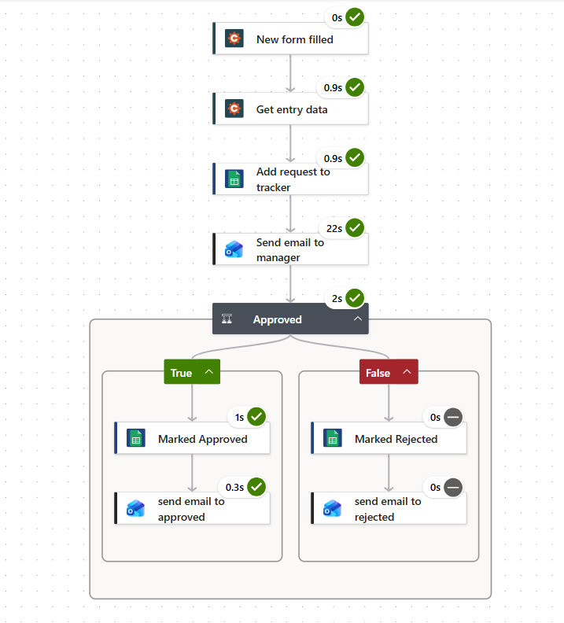
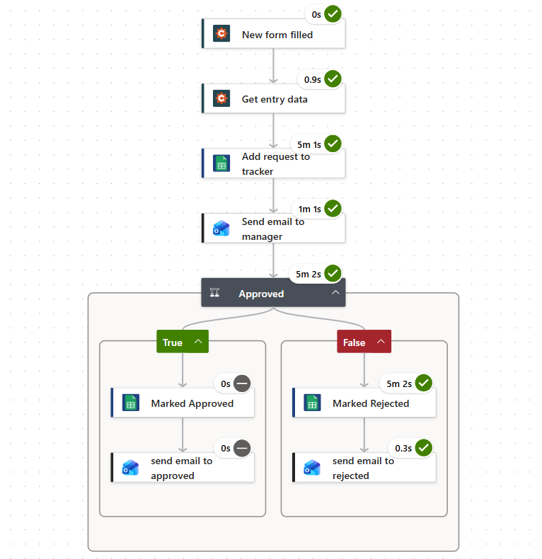
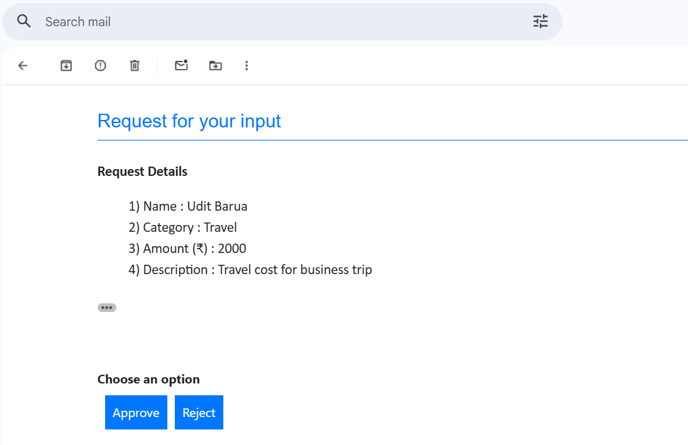
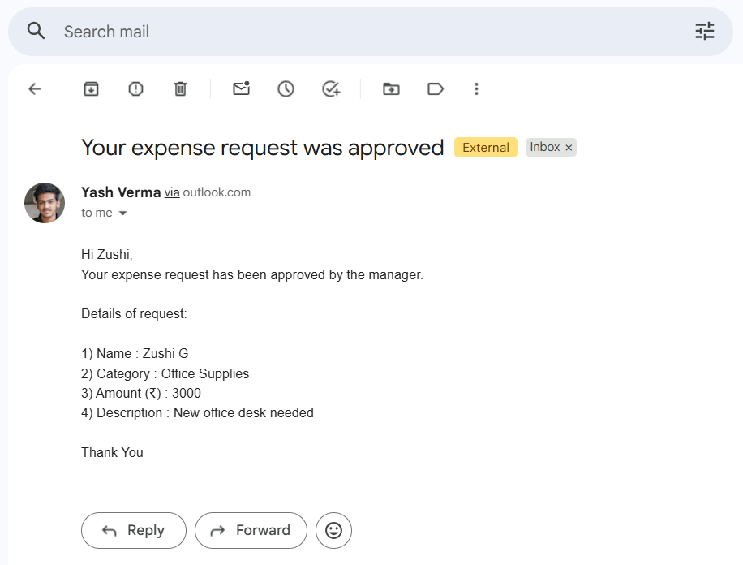
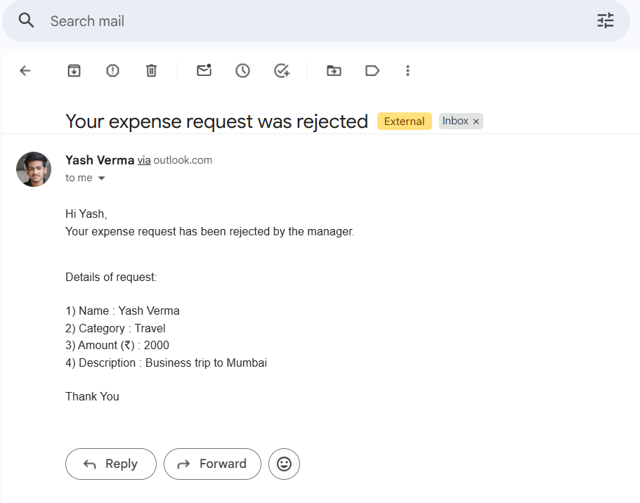

# Expense Approval Workflow

An automated expense approval workflow built with Power Automate. An employee submits a request through a form, a manager approves or rejects it from an email, and the result is recorded in a tracker and sent back to the employee.

## The Problem

Expense requests handled over email are hard to track. There is no single record of what was requested, who decided, or how long a decision took. Requests get lost, and nobody can see which ones are still waiting.

## What this does

1. An employee fills out the expense form (name, email, category, amount, description)
2. The flow logs the request in a Google Sheet with the status `Pending` and a submission timestamp
3. The manager receives an email with **Approve** and **Reject** buttons. The flow pauses until they respond
4. The flow updates the same row to `Approved` or `Rejected` and records the decision time
5. The employee receives an email with the outcome

## Connections

| Connection | Role |
|---|---|
| Cognito Forms | Collects the request |
| Power Automate (cloud flow) | Orchestrates the process |
| Outlook | Sends the approval email and the outcome emails |
| Google Sheets | Tracks every request and its status |

## How the flow is built

| Step | Action | Purpose |
|---|---|---|
| 1 | Cognito Forms: New form filled (trigger) | Starts a run for each submission |
| 2 | Cognito Forms: Get entry data | Fetches the full submission |
| 3 | Google Sheets: Add request to tracker | Inserts a row with status `Pending` |
| 4 | Outlook: Send email to manager (Send email with options) | Sends Approve / Reject buttons and waits for a response |
| 5 | Condition: Approved? | Checks whether the selected option equals `Approve` |
| 6a | If yes: Marked Approved, then email to requester | Sets status `Approved` and fills the decision time |
| 6b | If no: Marked Rejected, then email to requester | Sets status `Rejected` and fills the decision time |

## Screenshots

### Workflow (Approved Path)

### Workflow (Rejected Path)

### Email sent to manager

### Email sent to employees

## Tracker

See [`Expense_Approval_Tracker.xlsx`](Expense_Approval_Tracker.xlsx).

## Challenges

**1. Google Sheets API throttling (HTTP 429).**
The Google Sheets connector repeatedly returned "Too many requests", both while editing the flow and during runs. Some steps stalled for more than ten minutes before succeeding on retry.

**2. Email formatting.**
The approval email formatting was a complete mess; no line breaks, no bold text, etc. So, I used HTML code to fix it.

## Constraints

I built this without a Power Automate subscription and an organization account with multiple features disabled, so I worked within the standard connectors and free-tier limits. This shaped several decisions:

- Used Google Sheets as the tracker instead of a SharePoint List or Dataverse, which would normally suit this kind of workflow better.
- Premium features, such as the HTTP action and custom connectors, were not available to me.
- Had no way to raise API limits, which is why throttling was a recurring problem during testing.
- Had to use cognitive forms instead of Microsoft forms, bec

## What I would do differently in production

- Use a store built for the volume, such as a SharePoint List or Dataverse, instead of a spreadsheet
- Set a concurrency limit on the trigger so bursts of submissions do not all hit the tracker at once
- Add retry policies and an error branch that writes failures to the Error Log and notifies someone
- Put incoming requests in a queue (for example Azure Service Bus) and process them at a steady rate, so a large burst cannot overwhelm the tracker
- Second approver for larger amounts
- 48-hour escalation if the first approver does not respond

## Setup

1. Open `Expense_Approval_Tracker.xlsx` in Google Sheets
2. Create a Cognito Forms form with the same fields
3. In Power Automate, create an automated cloud flow with the steps in the table above and connect your own Cognito Forms, Google Sheets and Outlook accounts
4. Set the approver email and point the Google Sheets steps at your copy of the sheet
5. Submit a test entry and approve/reject it from the email

## Notes

Test data only. Email addresses and sheet IDs in the screenshots and export have been removed or replaced.
